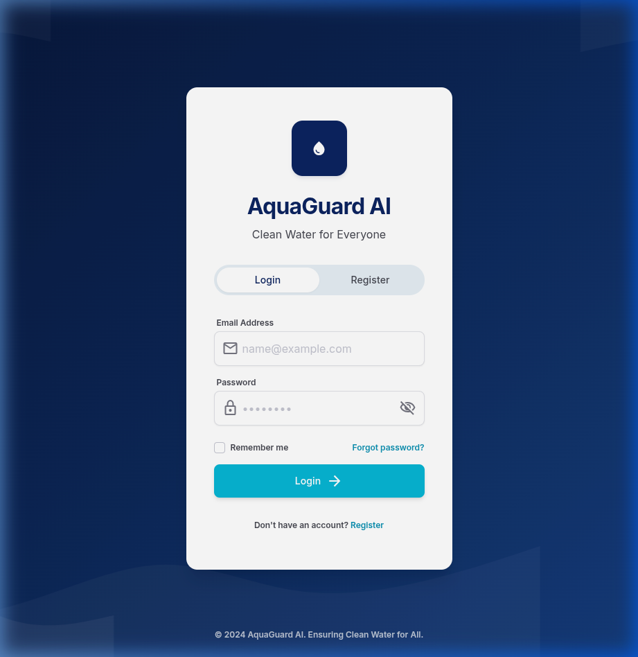
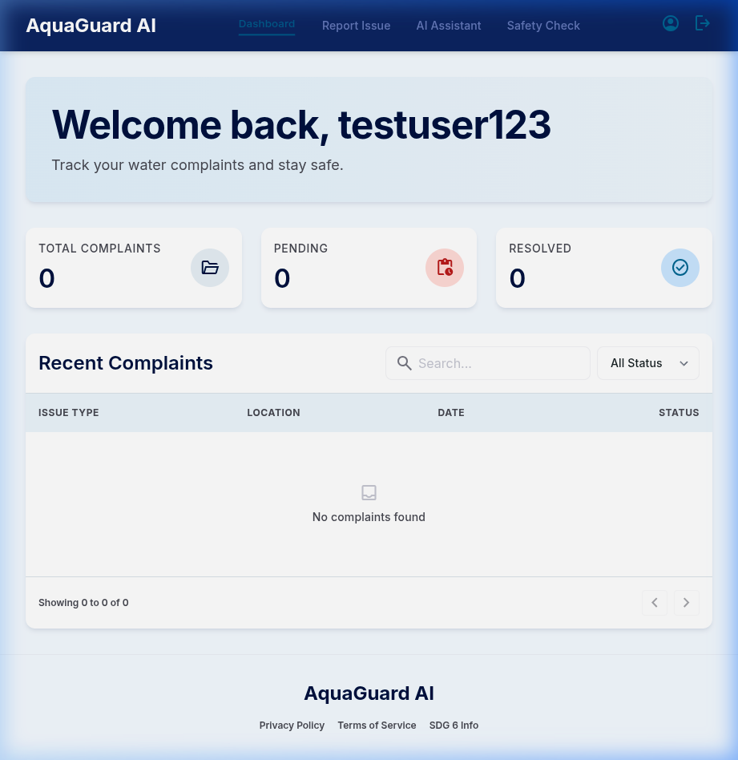
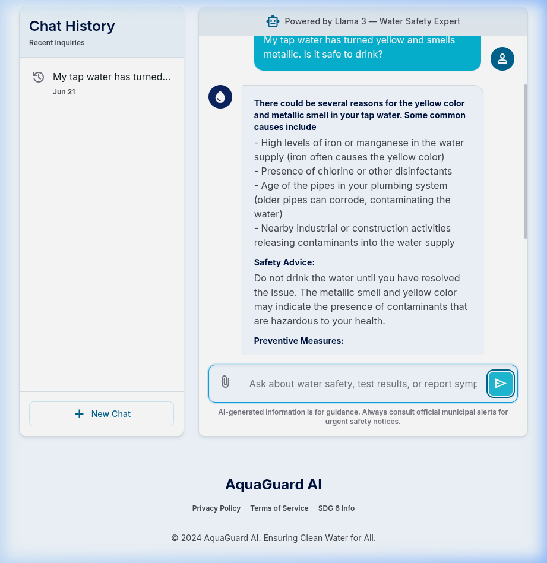
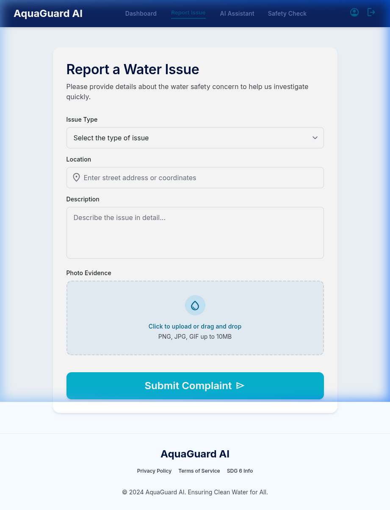
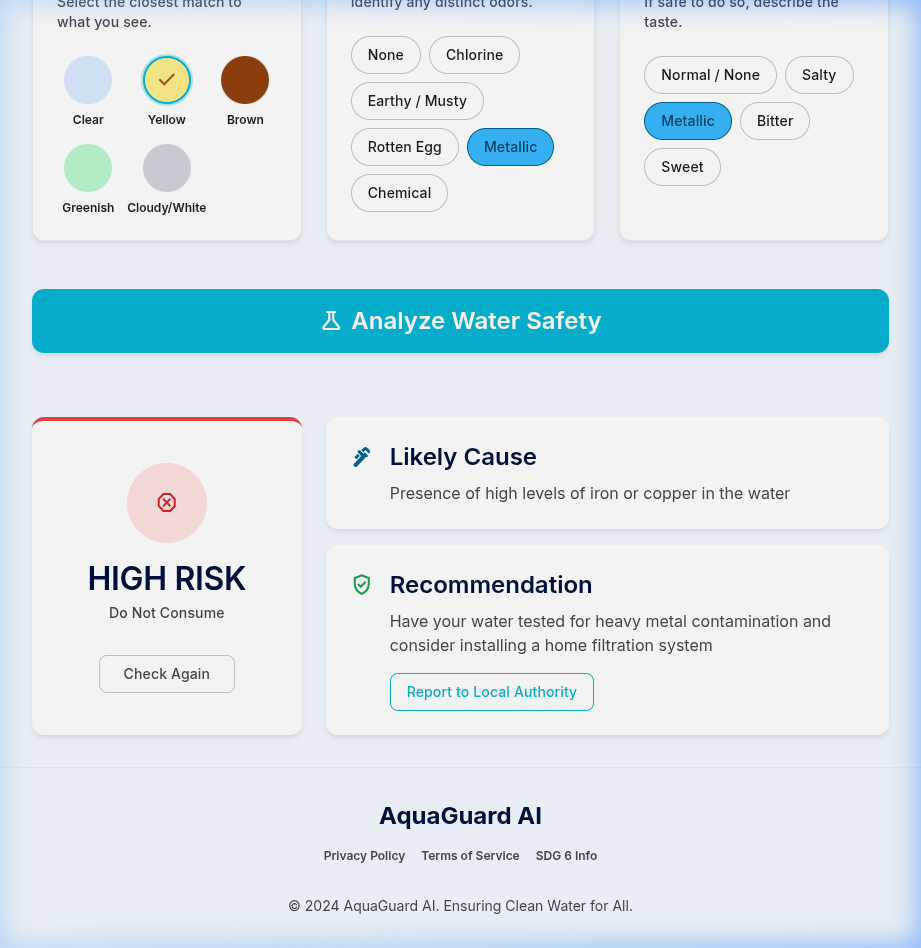

# 💧 AquaGuard AI — AI-Powered Water Safety Monitoring Platform

> **Capstone Project | SDG 6 — Clean Water and Sanitation**

AquaGuard AI is an AI-powered web application that empowers citizens to monitor, assess, and report water safety concerns in real time. It leverages **Generative AI (Llama 3.1 via Groq API)** to provide instant expert-level analysis and safety recommendations aligned with **UN Sustainable Development Goal 6**.

---

## ✨ Features

| Feature | Description |
|---------|-------------|
| 🔐 **User Authentication** | Secure login/register with Supabase Auth and session persistence |
| 📊 **Dashboard** | Personalized home with complaint stats, search, filter, and pagination |
| 🤖 **AI Chatbot** | Ask water safety questions — get structured expert advice powered by Llama 3 |
| 🧪 **Water Safety Checker** | Describe your water's color, smell, and taste — get instant AI risk assessment |
| 📝 **Report Issue** | Submit water complaints with photo evidence and track status |
| 📱 **Responsive Design** | Works seamlessly on desktop, tablet, and mobile |

---

## 🛠️ Technology Stack

| Layer | Technology |
|-------|-----------|
| Frontend | React 19, Vite 8, React Router v7 |
| Styling | Tailwind CSS v3.4 with custom design tokens |
| AI / NLP | Groq API + Llama 3.1-8B-Instant |
| Backend | Supabase (PostgreSQL, Auth, Storage) |
| Icons | Google Material Symbols |

---

## 🚀 Getting Started

### Prerequisites
- Node.js 18+
- npm or yarn
- Supabase account (free tier)
- Groq API key (free tier)

### Installation

```bash
# Clone the repository
git clone https://github.com/yourusername/aquaguard-ai.git
cd aquaguard-ai

# Install dependencies
npm install

# Create environment file
cp .env.example .env
# Edit .env with your Supabase and Groq API credentials

# Start development server
npm run dev
```

### Environment Variables

Create a `.env` file with:

```env
VITE_SUPABASE_URL=your_supabase_url
VITE_SUPABASE_ANON_KEY=your_supabase_anon_key
VITE_GROQ_API_KEY=your_groq_api_key
```

### Supabase Setup

Create the following tables in your Supabase project:

**complaints**
- `id` (uuid, primary key)
- `user_id` (uuid, references auth.users)
- `issue_type` (text)
- `location` (text)
- `description` (text)
- `image_url` (text, nullable)
- `status` (text, default: 'Pending')
- `created_at` (timestamptz)

**chats**
- `id` (uuid, primary key)
- `user_id` (uuid, references auth.users)
- `question` (text)
- `answer` (text)
- `created_at` (timestamptz)

Create a public storage bucket named `complaint-images`.

---

## 📸 Screenshots

### Login Page


### Dashboard


### AI Chatbot


### Report Issue


### Water Safety Checker


---

## 📁 Project Structure

```
aquaguard-ai/
├── public/
├── src/
│   ├── components/
│   │   ├── Footer.jsx
│   │   ├── Layout.jsx
│   │   ├── Navbar.jsx
│   │   └── ProtectedRoute.jsx
│   ├── context/
│   │   └── AuthContext.jsx
│   ├── lib/
│   │   ├── auth.js
│   │   ├── groq.js
│   │   └── supabase.js
│   ├── pages/
│   │   ├── AuthPage.jsx
│   │   ├── ChatPage.jsx
│   │   ├── CheckerPage.jsx
│   │   ├── DashboardPage.jsx
│   │   └── ReportPage.jsx
│   ├── App.jsx
│   ├── index.css
│   └── main.jsx
├── .env.example
├── .gitignore
├── index.html
├── package.json
├── tailwind.config.js
└── vite.config.js
```

---

## 🔮 Future Scope

- 📱 Mobile app (React Native / Flutter)
- 🌐 IoT sensor integration for real-time monitoring
- 🗺️ Geospatial heatmaps of water quality complaints
- 🌍 Multi-language support (Hindi, Marathi, Bengali)
- 🖼️ Computer vision for water photo analysis
- 🏛️ Government/NGO API integration
- 📶 PWA with offline support

---

## 📄 License

This project is open source and available under the [MIT License](LICENSE).

---
